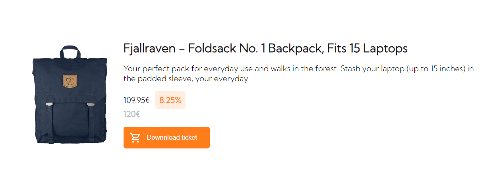
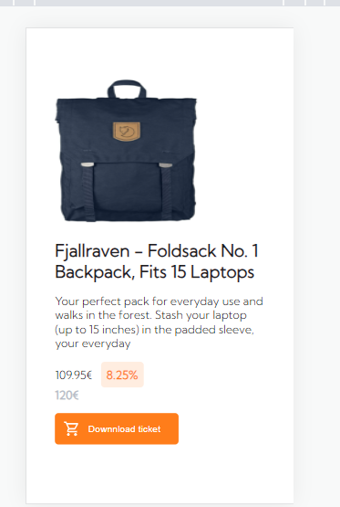
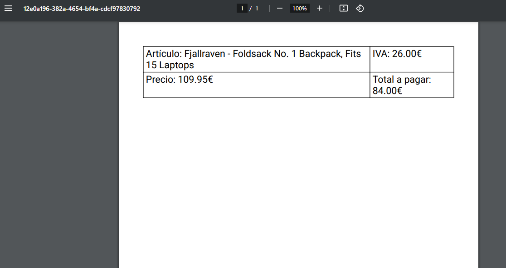

# Project Angular API REST and download pdf

## Technologies:

Angular, html, css, scss

## Description:

We use httpClient to call an API REST with product data and when the user press button we can download the data into a pdf document. We have used PdfMake in Angular.
Responsive design mobile First.

### Desktop

### Mobile

### PDF Document

